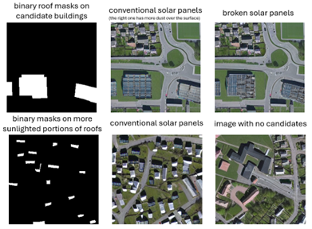

# Conditioned Diffusion Models for Solar Panel use case (UC3)

## Overview

Welcome to the UC3SolarPanels repository. This repository contains the implementation for the inference process of the third use case (UC3) of the SD4EO project. The SD4EO project explores the generation and use of synthetic datasets to improve Earth Observation (EO) analytics through AI-driven methodologies. UC3 focuses on generating synthetic aerial imagery conditioned to represent solar panels in urban areas, specifically for enhancing the training of solar panel detection systems.

This repository provides the tools for inferencing the diffusion model to create realistic synthetic aerial images, expanding upon the high-quality dataset already compiled by other researchers, including less common scenarios such as those arising from catastrophes (e.g., fires, earthquakes, sandstorms), which result in solar panels being broken or covered with sand, ash, and other debris. Unlike UC2, the AI-based UC3 generative solution exploits a pre-trained diffusion model available via the Hugging Face API, using it to insert synthetic solar panels into existing rooftop images with a resolution of 1m per pixel.

The overall goal is to expand the available datasets for solar panel detection, focusing on generating additional examples that include variations difficult to find in real-world imagery, such as panels covered with dust, partially damaged panels, or uncommon rooftop types.

## Project Context

The [SD4EO project](https://eo4society.esa.int/projects/sd4eo/), initiated in October 2023, aims to integrate physically-based simulation data and AI-based data generation tools into Earth Observation applications. UC3 specifically targets the generation of synthetic images representing solar panel installations in urban areas, aiming to improve the performance of solar panel detection systems by enriching datasets with varied and challenging cases. Initially, we attempted to use semantic inpainting, but the results were not satisfactory. Therefore, we opted for a solution based on generating conditioned images with OpenStreetMap maps (similar to UC2), where candidate rooftops are detected, and solar panels are drawn on them.

### Use Case 3: Solar Panel Detection

UC3 aims to enhance datasets for detecting rooftop solar panels. The adoption of rooftop solar panels in urban areas has grown significantly over recent years, making it important to track and monitor installations effectively. However, traditional datasets often lack the necessary variety and conditions, such as panels affected by dust or damage, to train highly robust models.

To address this, UC3 generates synthetic aerial images with solar panels in a variety of conditions:
- **Normal conditions** to represent typical rooftop solar panel installations, which is the case in most scenarios.
- **Covered by dust, sand, or grime** to simulate reduced efficiency.
- **Broken or partially damaged panels** to help in resilience and maintenance assessments.

The conditioned diffusion model used for UC3 is trained with a zoom level of 17 (corresponding to a resolution of approximately 1m per pixel) and is based on real imagery from the World Imagery service provided by ArcGIS Online. The inference process focuses on identifying candidate rooftop areas and placing solar panels oriented according to roof geometry, enhancing realism and aiding in accurate detection.

The key differences from use case 2 are:
1. **Zoom Level**: A higher zoom level (17) is used to achieve a resolution of 1m per pixel.
2. **Inference Only**: This repository provides inference scripts only, as the generative model is accessed via the Hugging Face API.
3. **Assembly Not Required**: The assembly of patches does not offer any added value for this use case. 

## Repository Structure
- **root/**: Contains scripts and tools to perform inference using the conditioned diffusion model (`image_gen_Z17.py`). This includes generating synthetic aerial images with different solar panel configurations. Plus helper scripts to preprocess images, perform segmentation, and handle bounding box annotations (`solarpanel.py`).
- **textures/**: Contains textures of large solar panel areas generated using diffusion models as a preprocessing step.

## Methodology Summary
The UC3 approach employs a pre-trained diffusion model accessed via the Hugging Face API to generate synthetic aerial images. The process involves:

1. **Base Image Synthesis**: The initial synthesis of the base image using a conditioned diffusion model to generate realistic aerial images with candidate rooftop structures.

2. **Detection of Candidate Areas**: Initial detection of candidate roof areas using basic thresholding methods to identify highly reflective surfaces that would be suitable for solar panel installation. These regions are marked with oriented bounding boxes.

3. **Semantic Inpainting of Solar Panels**: Using CG techniques to apply textures representing solar panels, including variations like dust accumulation and damage. The panels are placed according to the detected areas, ensuring that their orientation aligns with the geometry of the rooftop.

4. **Bounding Box Annotations**: The synthetic images are provided with corresponding bounding box annotations (in YOLO format) to support the training of object detection models like YOLOv8 or Mask R-CNN.

## Acknowledgments and Funding
This project is part of the SD4EO initiative, supported by ESA's FutureEO program.

This research work has been funded by the European Space Agency (ESA) under the FutureEO program and the SD4EO project (Contract No.: 4000142334/23/I-DT), supervised by the ESA Φ-lab.

## License
This project is licensed under the MIT License - see the LICENSE file for details.

## Disclaimer
Much of the base code used in this project originates from third-party open source projects. GMV can only claim authorship of the modifications and the methodology developed for this solution, but not any other rights over the entire codebase, as numerous external open source authors have contributed to it in various ways as code snippets and tutorials.

## Code Quality
Please note that the current codebase is not yet cleaned or restructured. As this is part of an ongoing research effort, the code quality is not intended to be equivalent to production-level standards. The focus is on experimental validation, and as such, some parts may lack optimization or refactoring.

## Datasets
One output dataset with several versions are available on Zenodo:

- **Output Dataset**: A dataset containing different example versions of generated synthetic images is also published on Zenodo for reference and validation purposes. Available at: [SD4EO: AI-based synthetic solar panel dataset on urban areas](https://zenodo.org/records/13118591)

