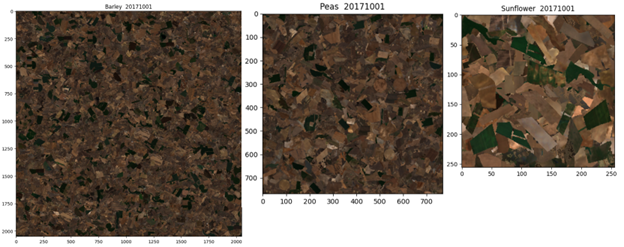

# Chaotic Aggregation

## Overview

Welcome to the ChaoticAggregation repository.

This repository contains the implementation of the core algorithm used to solve the polygon covering problem in the first use case (UC1) of the SD4EO project. UC1 is focused on creating input monoculture images to be used by the mcPS algorithm. As other heuristic solutions for polygon covering, the Chaotic Aggregation algorithm involves high-level mathematical methods to efficiently cover large crop areas, particularly in challenging agricultural landscapes with irregular field shapes.

This repository provides tools to generate these complex crop-covering compositions, using a combination of heuristics, metrics, and optimization techniques that are specifically designed for non-convex agricultural plots, including fields of various shapes and sizes.

The overall goal is to cover approximately square areas efficiently with available crop field data, preserving spatial coherence and maximizing the usable area for subsequent generative steps in UC1.

## Project Context

The SD4EO project, initiated in October 2023, aims to integrate physically-based simulation data and AI-based data generation tools into Earth Observation applications. This portion of the AI-based UC1 solutions specifically targets the creation of reference images for agricultural areas, providing valuable input data for the mcPS algorithm. ChaoticAggregation aims to generate large composite images of crop fields in a structured manner that allows their use for further analysis or synthetic data generation.

### Use Case 1: Crop Field Coverage

This portion of the AI-based UC1 solutions is focused on creating high-resolution images of monocultures, necessary to train models for agricultural resource management and analysis. The challenge lies in dealing with irregular, non-convex field shapes that often vary significantly in size and geometry.

To address this, the Chaotic Aggregation algorithm performs several tasks:

- **Polygon Covering Approximation**: Cover large square areas efficiently with available field polygons, even with challenging conditions like clouds or field fragmentation.
- **Maximizing Coverage**: The algorithm aims to maximize the usable area of each field, while accounting for field boundaries, cloud cover, and other obstructions.
- **Complex Geometry Handling**: Agricultural fields are often elongated or irregular in shape, making the problem of maximizing the coverage non-trivial.

The algorithm utilizes multispectral data from Sentinel-2 and Sentinel-1, incorporating different bands and resolutions to create meaningful composite images of agricultural areas.

The main challenges solved by the Chaotic Aggregation approach are:

1. **Complex Shapes**: Fields are often non-convex, irregularly shaped, or elongated, which makes traditional packing and covering algorithms less effective.
2. **Multi-Band Integration**: The use of multiple spectral bands (e.g., Sentinel-2 B02, B03, B08, and Sentinel-1 VH polarization) with different resolutions complicates the composition.
3. **Cloud and Shadow Management**: Accounting for cloud cover and shadows across various satellite passes, ensuring fields are effectively utilized without introducing errors.

## Repository Structure

- **root/**: Contains the main scripts implementing the Chaotic Aggregation algorithm (`plotExploration.py`), which handles the covering of large areas using the available agricultural field polygons. Plus helper scripts for preprocessing field data, handling Sentinel-1 and Sentinel-2 bands, and managing cloud effects on the input data.

## Methodology Summary

The Chaotic Aggregation approach utilizes an optimization algorithm to generate the desired composite images. The process involves:

1. **Field Extraction and Data Preparation**: Extract the boundaries of individual crop fields from available datasets. Preprocess these fields to remove one-pixel margins to reduce contamination from adjacent areas and handle cloud-affected sections.

2. **Heuristic-Based Placement**: Sort the fields by size, from largest to smallest, and place them in the target area, prioritizing minimal overlap. This step aims to maximize the coverage while considering the irregular shapes of the fields.

3. **Metric-Driven Placement**: Use a nonlinear metric to determine optimal placements for remaining fields, focusing on filling gaps between already placed fields. The algorithm calculates a distance measure for the domain and correlates this with the field contour to determine the best fit.

4. **Multispectral Inpainting for Completeness**: In cases where complete coverage cannot be achieved (usually due to the limited availability of crop fields), a multispectral inpainting algorithm is applied to fill in the remaining isolated pixels, ensuring that all bands are consistently filled.

The Chaotic Aggregation algorithm employs both randomized and metric-driven methods to find optimal coverage solutions, reducing computational costs and preserving spatial coherence across bands.

## Acknowledgments and Funding

This project is part of the SD4EO initiative, supported by ESA's FutureEO program.

This research work has been funded by the European Space Agency (ESA) under the FutureEO program and the SD4EO project (Contract No.: 4000142334/23/I-DT), supervised by the ESA Φ-lab.

## License

This project is licensed under the MIT License - see the LICENSE file for details.

## Disclaimer

Much of the base code used in this project originates from third-party open source projects. GMV can only claim authorship of the modifications and the methodology developed for this solution, but not any other rights over the entire codebase, as numerous external authors have contributed to it in various ways.

## Code Quality

Please note that the current codebase is not yet cleaned or restructured. As this is part of an ongoing research effort, the code quality is not intended to be equivalent to production-level standards. The focus is on experimental validation, and as such, some parts may lack optimization or refactoring.
The focus is on demonstrating the feasibility of polygon covering under the specific constraints of UC1.

## Datasets

This repository does not include any datasets, as the Chaotic Aggregation algorithm does not involve AI-based learning. Instead, it processes existing crop labelled satellite data, specifically Sentinel-2 and Sentinel-1 images, to create reference composites for monoculture areas.

