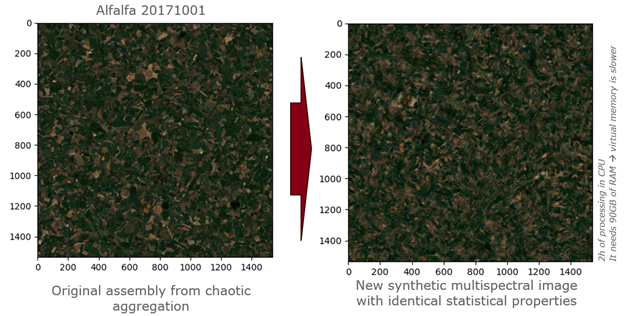
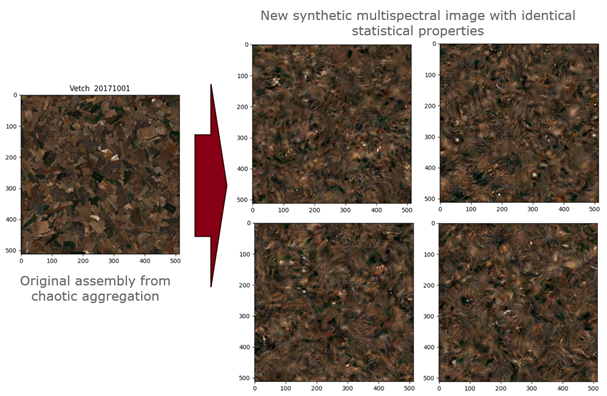

# CropTexSynthMethod1: Texture Synthesis Methods for Synthetic Crop Generation from Satellite point of view

## Overview
CropTexSynthMethod1 is a repository that contains code for generating multiband crop textures used in Earth Observation applications. This repository is part of the broader SD4EO project (Physically-Based Synthetic Data for Earth Observation), which aims to enhance the use of synthetic data in AI-driven Earth Observation tasks. Specifically, CropTexSynthMethod1 focuses on texture synthesis methods to generate realistic crop textures as they were captured by Sentinel-1 and Sentinel-2 imagery, with applications for simulating crop fields across different months and seasons.

The project includes two methods for texture synthesis:
1. A generalization of the Image Quilting algorithm, extending it to large-scale, multiband satellite imagery to simulate agricultural fields.
2. A multichannel adaptation of the Portilla-Simoncelli (mcPS) texture synthesis method, tailored for satellite imagery with numerous spectral channels.

These synthetic textures can be used to enrich Earth Observation datasets and improve the performance of machine learning models in tasks such as crop field categorization.

## Project Context

The SD4EO project, initiated in October 2023, aims to integrate physically-based simulation data and AI-based data generation tools into Earth Observation applications. This portion of the AI-based UC1 solutions is associated with Use Case which focuses on categorizing crop fields to improve agricultural monitoring and management. 
Synthetic data generated using this repository, combined with real satellite data, will help address challenges such as the lack of verified datasets for training machine learning models and the disproportionate representation of different crop types in existing public datasets.

For more details on the SD4EO project, please refer to the project documentation or visit the official [SD4EO project page](https://eo4society.esa.int/projects/sd4eo/).

## Methods
### Method 1: Image Quilting Generalization
This method is based on an extension of the Image Quilting algorithm originally proposed by Alexei Efros. The extension is designed to allow the synthesis of large areas of monoculture fields from small examples of real crop textures. The generated textures can represent crop fields for each month of the year and simulate different observation conditions captured by Sentinel-1 (SAR) and Sentinel-2 (multispectral) sensors according to the initial examplar used.

The core script for this method is `image_quilting.py`. It takes a small reference image of a crop texture and expands it into a larger synthetic field, preserving the visual continuity of the texture while covering larger areas. The method is capable of generating textures for various Mediterranean crops typically found in the area of interest, such as wheat, barley, and peas.

Although this method is effective for basic crop texture generation, it is recommended to use the Chaotic Aggregation method (another SD4EO approach), as it tends to produce better results when dealing with complex crop patterns.

### Method 2: Portilla-Simoncelli Texture Synthesis for Multiband Images
The second method is our multichannel extension of the Portilla-Simoncelli (mcPS) texture synthesis approach. Originally devised for single-channel and RGB images, it has been adapted to handle satellite imagery with a large number of spectral bands, such as Sentinel-2. The mcPS algorithm imposes high-order statistical constraints on local image features, synthesizing textures by iteratively optimizing the desired statistical properties in the transform domain.

The synthesis process involves two key steps: analysis and synthesis. The `texture_synthesis.py` script handles these steps:
- **Analysis**: Decompose the input image into wavelet sub-bands to derive statistical constraints.
- **Synthesis**: Start from white noise and iteratively apply the constraints to generate a synthetic texture.

This adaptation allows the algorithm to better capture the spectral relationships in multiband images, making it a suitable choice for generating realistic agricultural textures that resemble Sentinel imagery.

Neither of the two methods requires a GPU. Both methods can be run on a CPU with a set of common Python libraries. 

## Notes on Memory Usage
The PS method, due to its use of overcomplete wavelet decompositions, may require a substantial amount of memory, particularly for large satellite images with multiple spectral bands. If your system lacks sufficient RAM, consider working with smaller images or reducing the number of iterations during synthesis.

## Acknowledgements
This work is part of the SD4EO project, funded by ESA's FutureEO program, and involves collaboration between GMV NSL Ltd, GMV SGI, and the University of Valencia. Special thanks to Dr. Javier Portilla for his guidance in extending the Portilla-Simoncelli algorithm for multiband satellite imagery.

## License
This project is open-source and licensed under the MIT License. See the LICENSE file for more information.

## Disclaimer

Much of the base code used in this project originates from third-party open source projects. GMV can only claim authorship of the modifications and the methodology developed for this solution, but not any other rights over the entire codebase, as numerous external authors have contributed to it in various ways.

## Code Quality

Please note that the current codebase is not yet cleaned or restructured. As this is part of an ongoing research effort, the code quality is not intended to be equivalent to production-level standards. The focus is on experimental validation, and as such, some parts may lack optimization or refactoring.
The focus is on demonstrating the feasibility of polygon covering under the specific constraints of UC1.

## Datasets

This repository does not include any input datasets, as these algorithms do not involve traditional AI-based learning. 

- **Output Dataset**: A dataset containing different example versions of generated synthetic images is also published on Zenodo for reference and validation purposes. Available at: [Zenodo: SD4EO AI-based synthetic satellite multispectral agricultural textures in Spain (Oct 2017 - Sep 2018)](https://zenodo.org/records/11220860)

