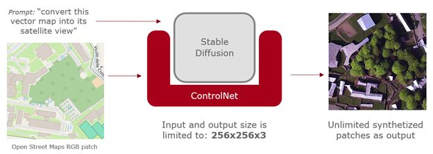

# Conditioned Diffusion Models for Building use case (UC2)

## Overview

Welcome to the UC2ConditionedDiffusionModel repository. This repository contains the implementation of the second use case (UC2) of the SD4EO project. The SD4EO project explores the generation and use of synthetic datasets to improve Earth Observation (EO) analytics through AI-driven methodologies. UC2 focuses on generating multispectral satellite images of cities using conditioned diffusion models, which can support the identification and categorization of human settlements. Specifically, this repository provides methods for creating datasets, training conditioned diffusion models, generating building masks, and assembling patches into full-resolution synthetic images for entire cities.

The repository is organized around three core objectives:

1. **Dataset Creation**: Generate patches of satellite imagery using OpenStreetMap and Sentinel-2 as baselines. Pixel-level masks serving as ground truth are also generated from OpenStreetMap images.
2. **Model Training**: Train a conditioned diffusion model to generate synthetic multispectral images (RGB and NIR) guided by conventional maps.
3. **Image Assembly**: Reconstruct entire urban areas from image patches, ensuring continuity across the generated multispectral images.

The overall goal is to expand the available datasets of high-resolution multispectral imagery, improving training inputs for AI models intended for urban and non-residential building detection.

## Project Context

The SD4EO project, initiated in October 2023, aims to integrate physically-based simulation data and AI-based data generation tools into Earth Observation applications. The AI-based  solution for UC2, specifically, is concerned with synthesizing realistic, high-resolution multispectral images using a conditioned diffusion model guided by imperfect map data. This approach offers an efficient way to expand and provide rare case datasets beyond the limitations of real-world satellite imagery, particularly useful in scenarios where building masks and high-resolution multispectral images are limited.

### Use Case 2: Human Settlement Categorization

AI-based UC2 solution exploits conditioned diffusion models to generate urban satellite imagery at the spatial resolution of Sentinel-2 for the RGB and NIR bands (10m x 10m pixels). The generated images are conditioned on rasterized guiding maps from OpenStreetMap, and these synthetic images are accompanied by building masks that delineate residential and non-residential buildings.

The process was developed as an alternative to end-to-end image generation, which would be computationally expensive and less precise due to dependence on upstream features learned by the generative model. Instead, the AI-based UC2 solution  starts with an initial schematic map and applies a three-step process to ensure high fidelity in both visual quality and building representation.

The three main steps of the UC2 conditioned diffusion approach are:

1. **Conditioning Map Generation**: Creating a georeferenced conditioning map from OpenStreetMap to guide the synthesis process. 
2. **Diffusion Model Training**: Training Stable Diffusion (v1.5) enhanced with ControlNet to generate RGB and NIR images in the combined latent space. Each training piece consists of two image pairs (one satellite image in the respective spectral band and one OpenStreetMap map with pixel-to-pixel correspondence), along with a prompt that guides the conversion. The diffusion model is conditioned using a geolocated segment of OpenStreetMap, which guides the denoising process and ensures that generated imagery is aligned with real urban layouts.
3. **Patch Assembly**: Using an optimized assembly algorithm to merge overlapping image patches into continuous surfaces, reducing visual discontinuities. Consistency between patches is extremely complex, as they are generated independently; however, structural continuity is ensured by the conditioning used during generation.  Individual patches are synthesized and subsequently assembled to form a continuous surface for an entire city. An overlap of approximately 18.75% is used to ensure smooth transitions between adjacent patches, and a dynamic programming-based algorithm is employed to determine the optimal composition.

## Repository Structure

- **LargeScaleDatasetPreparation/**: Contains scripts and tools to generate the dataset of OpenStreetMap patches and corresponding Sentinel-2 imagery (RGB + NIR).
- **root/ and diverse folders**: Holds the training scripts for the conditioned diffusion model using ControlNet, including hyperparameter settings and training data preparation steps.
- **root/**: Tools for generating building masks from OpenStreetMap data, categorizing residential and non-residential buildings.
- **PatchAssembler/**: Contains the logic for patch assembly, including overlap management and continuity adjustments to ensure realistic and seamless images.

## Data Sources

- **OpenStreetMap**: Used for the generation of conditioning maps, providing publicly available, georeferenced segments for urban areas.
- **Sentinel-2 Imagery (Copernicus)**: The target for image synthesis, representing the RGB (B4, B3, B2) and NIR (B8) bands at 10m spatial resolution.

The real satellite dataset used includes over 73,500 image pairs, generated using publicly licensed OpenStreetMap and Sentinel-2 data. Building masks are generated based on the semantic information provided by OpenStreetMap and then refined using a fuzzy classification process to differentiate between residential and non-residential structures.

## Results and Applications

Generated cities include Poitiers, Paris, Madrid, Toulouse, Bordeaux, Limoges, and others. The synthetic imagery enhances the available training data by providing diverse urban scenarios beyond those represented in the original dataset.

This approach can help improve models used for monitoring human settlements, urban planning, and environmental analysis, particularly where high-quality training data is scarce.

## Acknowledgments and Funding

This project is part of the SD4EO initiative, supported by ESA's FutureEO program.&#x20;

This research work has been funded by the European Space Agency (ESA) under the FutureEO program and the SD4EO project (Contract No.: 4000142334/23/I-DT), supervised by the ESA Φ-lab.

## License

This project is licensed under the Apache License, Version 2.0 - see the LICENSE file for details.

## Disclaimer on the License

Much of the base code used in this project originates from third-party open source projects. GMV can only claim authorship of the modifications and the methodology developed for this solution, but not any other rights over the entire codebase, as numerous external open-source authors have contributed to it in various ways in borrowed snippets and code pieces.

## Code Quality

This project has been developed over quite some time in a local repository, as it required many try-and-fail experiments before arriving at a feasible solution. I have only moved the necessary files here to reproduce the dataset and the training, both in their initial form.

Please note that the current codebase is not yet cleaned or restructured. As this is part of an ongoing research effort, the code quality is not intended to be equivalent to production-level standards. The focus is on experimental validation, and as such, some parts may lack optimization or refactoring.&#x20;

## Additional notes and important scripts

We aim to make our training images resemble the pixel size of OSM level 15/14, which means we have pixels measuring 3.3m on each side. One pixel from Sentinel-2 (10m/pixel) equals 3x3 of our pixels.

### Initial data generation

* For extracting pairs of Open Street Maps + Sentinel-2 patches for training dataset:
  * The functional script for obtaining OSM patches (to be executed within QGIS with warm up) is called `scan_native_res_v3.py`. 
  * The script for extracting patches from the S2 bands is `test_crop_v2.py` and the final conversion in `npztopng.py`
* For getting the guidance Open Street Maps *overlapping* patches for synthesis:
  * It must be executed also with within QGIS with warm up: `get_slide_OSM_patches_in_region.py`

### Training with conditioned Diffusion Model (SD1.5)

* `gmv_train.py` ???

### Inference with conditioned Diffusion Model (SD1.5)

* For RGB `image_gen2_city.py` 
  * can be easily setup for any city
  * we generate as many variations of each patch as indiicated
  * around 24sg per patch 
* For NIR : integrated inside `image_gen2_city.py` 

### Patch assemby

We can assemble RGB patches from Sentinel-2 & Open Street Maps (which fit perfectly) and synthetized patches (which require mincut to be sow in seamless way):

* For S2 patches: TODO 
  (`patch_assembler_177.py` no vale)
* For OSM: `PatcheAssembler/osm_assembler.py`
* For synthetic RGB overlapping patches: We use `PatcheAssembler/synthpatch_assembler.py` for generating both IR and RGB, but as independent images
* For building masks: mask_assembler.py

### Data rescaling 

We recover data from synthetic PNGs and we convert it again into netCDF xarrays in `fromPNGtoXarray.py`

### Building mask generation

* `mask_OSM_gen.py` has the support for creating the two required masks for building 
  It works with original OSM patches (usually 566x566) and provides a npz file with two boolean 2D numpy arrays. They are the SAME resolution as input images, so it must taken into account in later patch assembly (and overlapping management too).

### Format of intermediate files

- OSM patches are 566x566px, which will be resampled (and filtered) to 512x512
- In the .npz files (RGB+IR):
  - The two first dimensions go from 190x190 to 170x170 (depending on the Tile latitude), which will be resized to 512x512
  - The last dimension of the 3D arrays is:
    - Blue is slice 0 in the file (S2 original B2)
    - Green is slice 1 in the file (S2 original B3)
    - Red is slice 2 in the file (S2 original B4)
    - NIR is slice 3 in the file (S2 original B8).
- Labels: Simple TIF/PNG files with floating-point pixels ranging from 0.0 to 1.0 marking all buildings in one image, and non-residential buildings in the other image. The sampling grid aligns with Sentinel and has 10mx10m pixels.

### Final script

patch_distribution_final_dataset_v4

## Datasets

Three datasets are available on Zenodo:

1. **Input Datasets**: Due to licensing requirements, the input datasets are divided into two parts:
   - **Satellite Images Dataset**: Contains Sentinel-2 satellite imagery used for training. Available at [Zenodo: SD4EO: Sentinel-2 Northern France Patch Dataset (RGB+NIR)](https://zenodo.org/records/13957879)
   - **OpenStreetMap Dataset**: Contains OpenStreetMap patches used as conditioning maps. Available at: [Zenodo: SD4EO Open Street Maps Northern France Patch Dataset](https://zenodo.org/records/13958096)

2. **Output Dataset**: A dataset containing five example versions of generated synthetic images is also published on Zenodo for reference and validation purposes. Available at: [Zenodo: SD4EO AI-based synthetic satellite Sentinel-2 images of cities and building coverture (RGB+NIR bands)](https://zenodo.org/records/14025435). GMV can only claim authorship of the modifications and the methodology developed for this solution, but not any other rights over the entire codebase, as numerous external authors have contributed to it in various ways.

